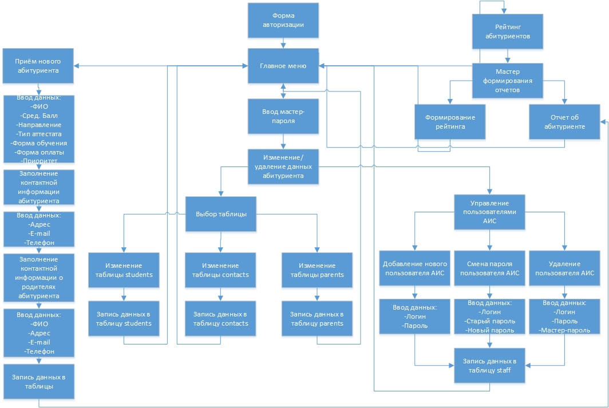

# Разработка АИС «Абитуриент Колледжа»
Курсач за 3 курс, пишем на ООП не зная ООП, интегрируем графику не зная графики ©

## Логическая модель задачи:

## Логическая модель программы:

## Информационная модель программы:

### Changelogs:
--------------------------------------------------------------------------
* Презентация - поставить кнопки перехода по слайдам и допилить слайды
* ПЗ - После того, как закончу презентацию вставить в приложение В.
* ПЗ - Проблемы с абзацами - забить или нет ???
* Поставить try/catch в запросах или использовать параметризованные запросы 
--------------------------------------------------------------------------
* RemoveStaffForm.h - форма удаления пользователей АИС  - ОК
* В очередной раз передлать все (Лог схема, сх) - ОК
* Проверка на опечатки в названиях - ОК 
* Упрощение кода, если возможно - невозможно
---------------------------------------------------------------------------
* Вход по логину/паролю, отдельная таблица users в БД, проверка также по MD5 - OK
* MainStaffForm.h - форма выбора действий с пользователями АИС - OK
* PasswordStaffForm.h - форма смены паролей пользователей АИС - OK
* AddNewStaffForm.h - форма добавления нового пользователя АИС - OK
* BufValidationStr в AddNewStaffForm.h - OK
---------------------------------------------------------------------------
* FinalPrintForm.h - отчеты, красивый вывод в Word в записимости от выбранных параметров - OK
* DBChangerForm.h - как часть формы MainDBChangerForm.h - OK
  
  MainDBChangerForm.h представляет собой форму с переходом на:
  	* DBChangerForm.h <-> MainDBChangerForm.h - OK
  	* ContactsDBChangerForm.h - OK
  	* ParentsDBChangerForm.h - OK
* Ввести пароль на MainDBChangerForm с чеком по MD5 хешу -OK
* Доделать формирование рейтинга с выборкой по специальности и форме оплаты в Word через RatingForm.h->PrintForm.h - OK
---------------------------------------------------------------------------
